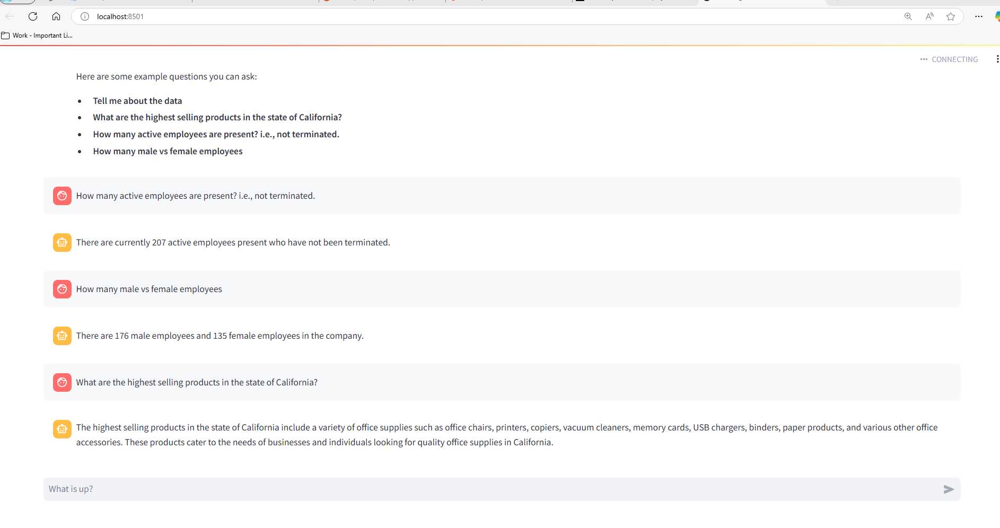

# MLOps Proof of Concept (POC)

This repository contains a Proof of Concept (POC) for a self-service reporting assistant using MLOps principles. The assistant leverages the OpenAI API to provide an interactive and user-friendly interface for generating reports.


[](https://codecov.io/gh/prithvijitguha/mlops-poc)&nbsp;
&nbsp;
&nbsp;
[](https://flowrunner.readthedocs.io/en/latest/?badge=latest)&nbsp;
[](https://www.python.org/downloads/release/python-390/)&nbsp;
[](https://github.com/psf/black)&nbsp;
[](https://pycqa.github.io/isort/)&nbsp;
[](https://github.com/pre-commit/pre-commit)

# Demo Screenshot:



## Technical Documentation

For more detailed information about the project, please refer to our [technical documentation on ReadTheDocs](https://mlops-poc.readthedocs.io/en/latest/).

## Getting Started

### Prerequisites

- Python 3.11 or higher
- pip

### Installation

You can install the necessary dependencies by running one of the following commands:

```shell
pip install .[dev] .
```
## Instructions to run:
```shell
pip install .[dev] .
```
OR

```shell
pip install -r requirements-dev.txt -r requirements.txt -r requirements-docs.txt

```

### Configuration

Create a .env file in the root directory of the project and add your OpenAI API Key:

Your file contents should look like

```yaml
# environment variables defined inside a .env file
OPENAI_API_KEY=my-open-ai-api-key
```

Replace my-open-ai-api-key with your actual OpenAI API key.

### Running the application

After installing the dependencies and setting up the configuration, you can run the application with the following command:
```shell
streamlit run src/web/app.py
```

Some reference reading:
- [open-ai-documentation](https://platform.openai.com/docs/introduction)
- [openai-python](https://github.com/openai/openai-python/tree/main)
- [open-ai-cookbook](https://github.com/openai/openai-cookbook/tree/main)
